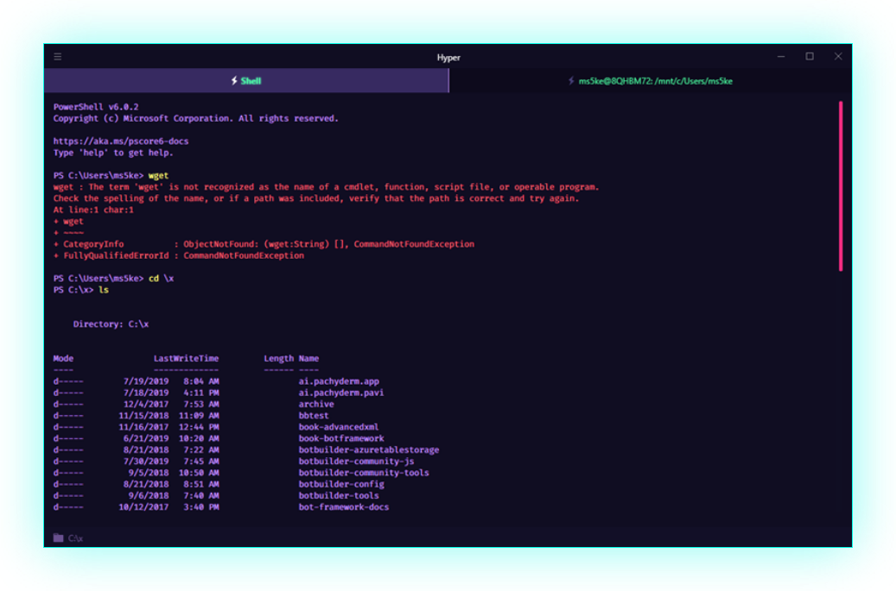
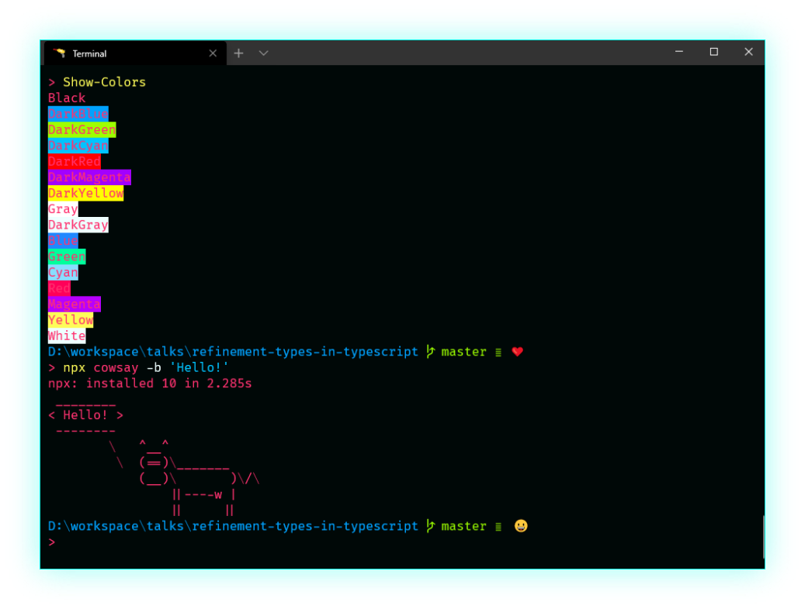
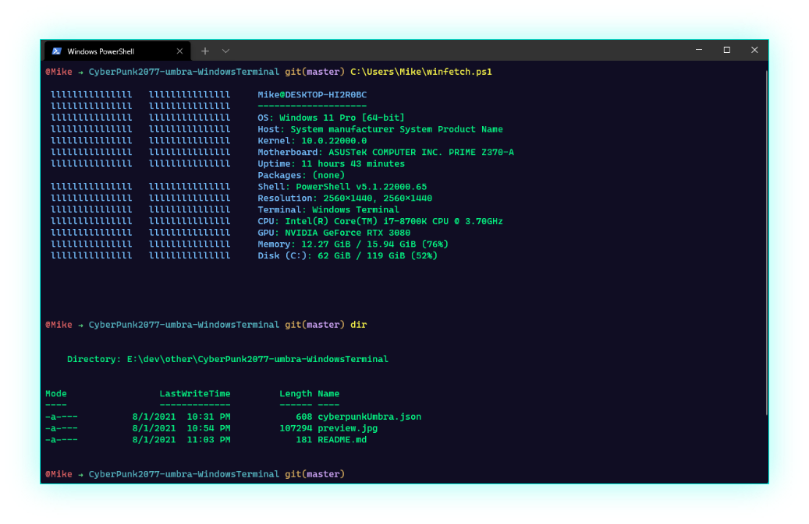

<h1>A crazy Cyberpunk theme for Visual Studio Code.</h1>

<h1>That's it! Activate now the UMBRA protocol.</h1>

<h1>👾 That's it! Activate now the SCARLET protocol 👾 (BETA).</h1>

I know, it may look like a rainbow and even give the sensation of distraction.
But fundamentally I chose the cyberpunk theme, because it allows me to use a very wide color palette, this helps each fragment of code to have practically a color, so our eye quickly detects color changes and our brain is processing and memorizing the information received. This can help unconsciously improve your productivity when programming, as we recognize quickly, for example: if it is an object, a class, a method, etc...

 
 

### Cyberpunk Chrome theme

### Cyberpunk iTerm

### Cyberpunk Hyper

### Cyberpunk SCARLET for Windows Termin

### CyberPunk2077 Umbra Windows Terminal

 
 

- You are freelance, you have a team or in your company use Slack?, keep everything in tune with cyberpunk.
Copy and paste these colors to customize your Slack.
`#372963,#100D23,#100d23,#00FF9C,#100D23,#c592ff,#00FF9C,#ff4081`

 
 

Don't forget to rate

 
 
 
 
 
 
 

